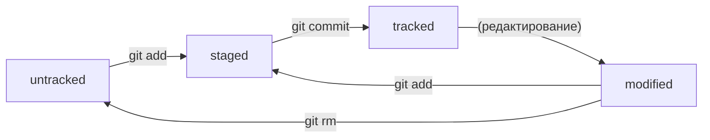

# Git-s-basics-commands

## Основные команды Git


**Навигация:**

+	**pwd** (от англ. print working directory, «показать рабочую папку») — покажи, в какой я папке;
+	**ls** (от англ. list directory contents, «отобразить содержимое директории») — покажи файлы и папки в текущей папке;
+	**ls -a** — покажи также скрытые файлы и папки, названия которых начинаются с символа .;
+	**cd first-project** (от англ. change directory, «сменить директорию») — перейди в папку first-project;
+	**cd first-project/html** — перейди в папку html, которая находится в папке first-project;
+	**cd ..** — перейди на уровень выше, в родительскую папку;
+	**cd ~** — перейди в домашнюю директорию (/Users/Username);
+	**cd /** — перейди в корневую директорию.


**Работа с файлами и папками**


**Создание**

+	**touch index.html** (англ. touch, «коснуться») — создай файл index.html в текущей папке;
+	**touch index.html style.css script.js** — если нужно создать сразу несколько файлов, можно напечатать их имена в одну строку через пробел;
+	**mkdir second-project** (от англ. make directory, «создать директорию») — создай папку с именем second-project в текущей папке.


**Копирование и перемещение**

+	**cp file.txt ~/my-dir** (от англ. copy, «копировать») — скопируй файл в другое место;
+	**mv file.txt ~/my-dir** (от англ. move, «переместить») — перемести файл или папку в другое место.


**Чтение**

+	**cat file.txt** (от англ. concatenate and print, «объединить и распечатать») — распечатай содержимое текстового файла file.txt.


**Удаление**

+	**rm about.html** (от англ. remove, «удалить») — удали файл about.html;
+	**rmdir images** (от англ. remove directory, «удалить директорию») — удали папку images;
+	**rm -r second-project** (от англ. remove, «удалить» + recursive, «рекурсивный») — удали папку second-project и всё, что она содержит.


**работа с репозиторием**

+ 	**git init** - сделать папку репозиторием 
+ 	**— rm -rf .git** - «_разгитить_» папку, если что-то пошло не так
+ 	**git status** - проверить состояние репозитория
+ 	**git add** - подготовить файлы к сохранению
+ 	**git commit** - выполнить коммит
+ 	**git log** - просмотреть историю коммитов
+ 	**git remote add** - привязать удалённый репозиторий к локальному
+ 	**git push** - отправить изменения на удалённый репозиторий
+ 	**git remote -v** - убедиться, что репозитории связаны
+ 	**git push** - отправить изменения на удалённый репозиторий
+ 	**git clone** - клонировать репозиторий


## Хеш

**Хеш — идентификатор коммита**

Информация о коммите — это набор данных: когда был сделан коммит, содержимое файлов в репозитории на момент коммита и ссылка на  
предыдущий, или родительский (англ. parent), коммит. Git хеширует (преобразует) эту информацию с помощью алгоритма SHA-1  
(от англ. Secure Hash Algorithm — «безопасный алгоритм хеширования») и получает для каждого коммита свой уникальный хеш —  
результат хеширования.
В то время, как результат работы метода hashCode() — это целое число, результат хеширования в Git — символьная строка. Она  
относительно коротка (40 символов в случае SHA-1) и состоит из цифр 0—9 и латинских букв A—F (неважно, заглавных или  
строчных). Хеш обладает следующими важными свойствами:

+    если хеш получить дважды для одного и того же набора входных данных, то результат будет гарантированно одинаковый;
+    если хоть что-то в исходных данных поменяется (хотя бы один символ), то хеш тоже изменится (причём сильно).


## Лог

После вызова git log появляется список коммитов с их описанием.

Вот из каких элементов состоит описание:

    1. Строка из цифр и латинских букв после слова **commit** — это уже знакомый вам хеш коммита.
    2. **Author** — имя автора и его электронная почта.
    3. **Date** — дата и время создания коммита.
    4. Сообщение к коммиту.
	
Если в репозитории уже много коммитов — например, сотни или тысячи, — пригодится сокращённый лог. С ним можно быстро найти нужный  
коммит по описанию.
Сокращённый лог вызывают командой git log с флагом --oneline (англ. «одной строкой»). При этом в терминале появятся только первые  
несколько символов хеша каждого коммита и комментарии к ним.

Сокращённый хеш (первые несколько символов полного) можно использовать точно так же, как и полный. Для этого команда  
git log --oneline автоматически подбирает такую длину сокращённых хешей, чтобы они были уникальными в пределах репозитория и Git  
всегда мог понять, о каком коммите идёт речь.

:bulb: Обратите внимание: если выход из просмотра логов не произошёл автоматически, нажмите клавишу Q (от англ. Quit — «выйти») в  
английской раскладке клавиатуры.


## Head

Файл HEAD (англ. «голова», «головной») — один из служебных файлов папки .git. Он указывает на коммит, который сделан последним  
(то есть на самый новый).

Внутри HEAD — ссылка на служебный файл: refs/heads/master (или refs/heads/main в зависимости от названия ветки). Если заглянуть в  
этот файл, можно увидеть хеш последнего коммита.

Когда вы делаете коммит, Git обновляет refs/heads/master — записывает в него хеш последнего коммита. Получается, что HEAD тоже  
обновляется, так как ссылается на refs/heads/master.

При работе с Git указатель HEAD используется довольно часто. Мы уже упоминали, что многие команды Git принимают в качестве  
параметра хеш коммита. Если нужно передать последний коммит, то вместо его хеша можно просто написать слово HEAD — Git поймёт,  
что вы имели в виду последний коммит.


## Cтатусы файлов

Одна из ключевых задач Git — отслеживать изменения файлов в репозитории. Для этого каждый файл помечается каким-либо статусом.

+    **untracked** (англ. «неотслеживаемый»)

      Новые файлы в Git-репозитории помечаются как untracked, то есть неотслеживаемые. Git «видит», что такой файл существует, но  
	  не следит за изменениями в нём. У untracked-файла нет предыдущих версий, зафиксированных в коммитах или через команду  
	  git add.
	  	 
+    **staged** (англ. «подготовленный»)

      После выполнения команды git add файл попадает в staging area (от англ. stage — «сцена», «этап [процесса]» и area —  
	  «область»), то есть в список файлов, которые войдут в коммит. В этот момент файл находится в состоянии staged.

:bulb: Staging area также называют index (англ. «каталог») или cache (англ. «кеш»), а состояние файла staged иногда называют indexed  
или cached. Все три варианта могут встречаться в документации и в качестве флагов команд Git.

+    **tracked** (англ. «отслеживаемый»)

      Состояние tracked — это противоположность untracked. Оно довольно широкое по смыслу: в него попадают файлы, которые уже были 
	  зафиксированы с помощью git commit, а также файлы, которые были добавлены в staging area командой git add. То есть все файлы, 
	  в которых Git так или иначе отслеживает изменения.
	  
+    **modified** (англ. «изменённый»)

      Состояние modified значит, что Git сравнил содержимое файла с последней сохранённой версией и нашёл отличия. Например, файл  
	  был закоммичен и после этого изменён.

Вот что ещё важно учесть:

+    Для файлов в состояниях staged и modified обычно не указывается, что они также tracked, потому что это состояние  
	 подразумевается.
	 
+    Команда git add добавляет в staging area только текущее содержимое файла. Если вы, например, сделаете git add file.txt, а  
	 затем измените file.txt, то новое содержимое файла не будет находиться в staging. Git сообщит об этом с помощью статуса  
	 modified: файл изменён относительно той версии, которая уже в staging. Чтобы добавить в staging последнюю версию, нужно  
	 выполнить git add file.txt ещё раз.
	 


# Оформление сообщений к коммитам

В выводе команды git log --oneline умещается максимум 72 первых символа сообщения, поэтому многие правила включают пункт:  
«Сообщение не должно быть длиннее 72 символов».

Есть общие рекомендации по тому, как правильно составить сообщение. Оно должно быть:

+    относительно коротким, чтобы его было легко прочитать;
+    информативным.


# Стили оформления

## Корпоративный

Во многих компаниях применяется Jira — система для организации проектов и задач. У каждой задачи в Jira есть идентификатор из  
нескольких заглавных латинских букв и номера. Например, LGS-239 значит, что это 239-я задача в проекте **LGS** (сокращение от англ.  
logistics — «логистика»).
В корпоративном стиле в начале сообщения обычно указывают Jira-ID, а после — текст сообщения.
```$ git commit -m "LGS-239: Дополнить список пасхалок новыми числами"```

## Conventional Commits

Стандарт **Conventional Commits** (англ. «соглашение о коммитах») отличается качественной документацией и подробной проработкой. Он  
подходит для репозиториев с исходным кодом программ. А вот использовать его для других типов проектов было бы неудобно.
Conventional Commits предлагает такой формат коммита: <type>: <сообщение>. Первая часть type — это тип изменений. Таких типов  
достаточно много. Вот два примера:

+    feat (сокращение от англ. feature) — для новой функциональности;
+    fix (от англ. «исправить», «устранить») — для исправленных ошибок.

Например, сообщение может быть таким.
```git commit -m "Исправить #334, добавить график температуры"```

## GitHub-стиль

GitHub можно использовать не только для хранения файлов проекта, но и для ведения списка задач (англ. issue) этого проекта. Если  
коммит «закрывает» или «решает» какую-то задачу, то в его сообщении удобно указывать ссылку на неё. Для этого в любом месте  
сообщения нужно указать #<номер задачи>. Например, вот так.
```git commit -m "Исправить #334, добавить график температуры" ```

:bulb: Для сообщений на русском языке часто рекомендуют использовать инфинитивы. Например: Добавить тесты для PipkaService,  
Исправить ошибку #123 и так далее.

Для сообщений на английском рекомендуется использовать **повелительное наклонение** (англ. imperative). Например:  
Use library mega_lib_300, Fix exit button и так далее.

Эти рекомендации сложились исторически, и им следуют многие проекты.